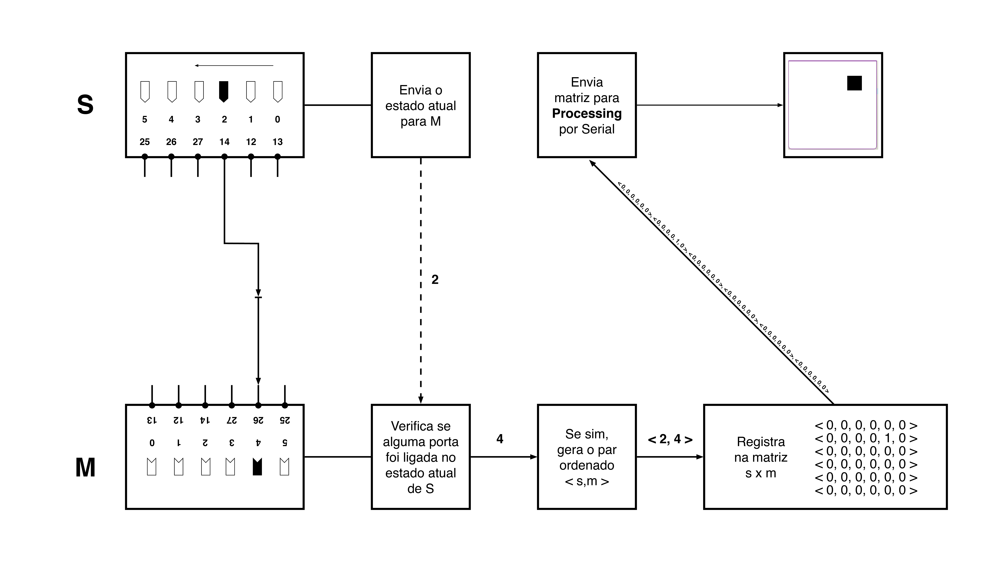

# Matriz-S-M
**Grupo Realidades — USP**
## Sobre
Matriz S × M é uma instalação que articula projeção, circuitos eletrônicos e participação do público por meio de cabos e conectores de tomada impressos em 3D. Quando os plugues são ligados, eles conectam dois circuitos intercomunicantes que registram as combinações realizadas e as traduzem em pontos na projeção, interligados por linhas geradas a partir de modelos estatísticos, formando composições visuais em contínua mutação. O desenho dos conectores desloca as categorias normativas de “macho” e “fêmea”, permitindo múltiplas possibilidades de acoplamento e sugerindo uma lógica de sexualidade em permanente permutação. Paralelamente, o comportamento dinâmico das linhas é modulado em tempo real pela quantidade de visitantes presentes no dia, cuja contagem, exibida em um painel de LED, interfere diretamente no movimento e na densidade das conexões. Uma primeira versão da obra foi apresentada em novembro de 2025 na Galeria Vermelho, durante o Festival Mix, em colaboração com o Grupo Depois do Fim da Arte.
## Funcionamento
A interação com a projeção por meio dos cabos e conectores disponíveis ao público é mediada por dois circuitos baseados em ESP32 WROOM, denominados **S** e **M**. O circuito **S** executa continuamente uma varredura de seus pinos digitais, ativando uma única porta por vez e transmitindo ao circuito **M** a identificação da porta atualmente energizada. Quando o circuito **M** detecta sinal em uma de suas entradas, consulta o índice de porta informado por **S** e registra a combinação correspondente como um par ordenado `<s,m>`, em que `s` representa a porta ativa em **S** e `m` a porta acionada em **M**.

Os pares registrados são armazenados por **M** em uma matriz binária `S × M` de dimensão `16 × 16`, correspondente ao número total de portas e cabos disponíveis em cada circuito. Cada célula da matriz representa o estado de conexão entre um par específico de portas. Em uma matriz `3 × 3`, por exemplo, o formato seria `<<0,0,0>,<0,0,0>,<0,0,0>>`, em que valores `1` indicam conexões ativas e valores `0` indicam ausência de conexão. O esquema a seguir oferece uma visualização da transmissão de mensagens entre os circuitos.



A matriz é então transmitida a um terceiro ESP32, denominado **T**, responsável pela comunicação serial com o computador que executa o código em Processing encarregado da geração visual da projeção em tempo real. Paralelamente, **T** também recebe os dados provenientes do circuito contador de visitantes, utilizado para modular parâmetros dinâmicos da visualização, como velocidade, densidade e comportamento das linhas projetadas.
## Processing

O sistema visual da instalação é desenvolvido em Processing e opera a partir da leitura serial de uma matriz binária enviada por circuitos ESP32 WROOM. Cada atualização recebida corresponde ao estado instantâneo das conexões físicas realizadas pelo público nos conectores da obra.


A matriz principal possui dimensão 16 × 16, sendo composta por valores binários (`0` ou `1`) que representam a presença ou ausência de conexão em cada coordenada `<s,m>`. Essas ativações são utilizadas simultaneamente em três camadas do sistema:

1. visualização dos nós ativos;
2. geração probabilística das conexões gráficas;
3. formação de traços de memória estatística.

### Comunicação serial

O código tenta inicialmente estabelecer comunicação serial através da porta `COM19`.

Caso a porta não seja encontrada, o sistema permanece funcional em modo autônomo. Nesse estado, é possível ativar uma simulação pressionando a tecla `s`. A simulação produz ativações e desativações progressivas ao longo do grid, fazendo com que o programa gere internamente matrizes binárias coerentes com o protocolo serial utilizado pelos circuitos físicos.

### Estrutura matricial

A matriz principal é armazenada na variável:

```java
int[][] matriz = new int[16][16];
```

Cada posição da matriz corresponde a uma coordenada espacial da projeção.

As informações recebidas serialmente são inicialmente escritas em um buffer temporário (`bufferMatriz`) e apenas aplicadas à matriz principal após o recebimento do comando `UPDATE`, garantindo sincronização completa entre os estados do sistema.

### Nós visuais

Cada célula ativa da matriz é desenhada como um nó circular animado.

Os pontos possuem pequenas oscilações temporais calculadas por funções trigonométricas (`sin` e `cos`), cuja intensidade varia conforme o número de visitantes registrados no sistema. O resultado é um campo visual instável e continuamente vibrante.

Cada nó também exibe:

- sua coordenada matricial `<i,j>`;
- a porcentagem relativa de memória acumulada naquela posição.

### Traços de memória

O sistema mantém uma matriz contínua de memória:

```java
float[][] ativacoes
```

Essa estrutura não registra apenas ativações instantâneas, mas sim a persistência estatística das conexões ao longo do tempo.

Sempre que uma coordenada é ativada:

```java
ativacoes[i][j] += 1.0;
```

Paralelamente, todas as posições sofrem um processo contínuo de esquecimento:

```java
ativacoes[i][j] *= memoryDecay;
```

O parâmetro:

```java
float memoryDecay = 0.9995;
```

define a velocidade de dissipação dos traços acumulados.

Isso produz um modelo probabilístico dinâmico no qual:
- conexões recorrentes tornam-se mais prováveis;
- padrões pouco utilizados desaparecem gradualmente;
- o sistema preserva apenas memórias estatisticamente reforçadas.

### Geração probabilística das conexões

As linhas desenhadas na projeção não representam conexões físicas diretas entre os cabos. Elas são geradas probabilisticamente a partir da distribuição dos traços de memória acumulados no sistema.

A probabilidade de criação de uma conexão depende da intensidade da memória associada a determinada combinação:

```java
float probability =
  memoryWeight /
  (memoryWeight + 5.0);
```

Quanto mais recorrente uma região da matriz, maior sua tendência de produzir novas conexões gráficas.

O resultado é um sistema visual que apresenta:
- reforço estatístico de padrões recorrentes;
- dissipação gradual de padrões esquecidos;
- reorganização contínua das relações visuais.

### Conexões animadas

As conexões são desenhadas como curvas de Bézier animadas.

Cada conexão possui parâmetros próprios de:
- velocidade;
- frequência;
- turbulência;
- oscilação;
- dissipação.

Esses parâmetros são parcialmente modulados pela quantidade de visitantes registrados no sistema, produzindo alterações graduais na densidade e no comportamento das linhas.

### Painel probabilístico lateral

À direita da projeção principal, o sistema exibe uma matriz numérica derivada da distribuição dos traços de memória.

Cada célula representa:

```math
P(i,j) = M(i,j) / ΣM
```

onde:
- `M(i,j)` corresponde à intensidade do traço de memória da posição;
- `ΣM` corresponde à memória total acumulada do sistema.

O painel funciona como uma visualização estatística contínua da memória ativa da instalação.

### Visitantes

O sistema recebe continuamente informações de presença pública através de um contador externo conectado via serial.

O número de visitantes modula parâmetros globais da visualização, incluindo:
- velocidade das conexões;
- amplitude das oscilações;
- frequência das curvas;
- quantidade de conexões geradas.

Essa influência é convertida em um valor contínuo de intensidade (`globalMood`) através de uma curva logarítmica suavizada.

### Estrutura geral do sistema

O fluxo principal do programa pode ser resumido da seguinte forma:

```text
ESP32 S/M
    ↓
matriz serial binária
    ↓
bufferMatriz
    ↓
matriz principal
    ↓
traços de memória
    ↓
probabilidades
    ↓
geração de conexões
    ↓
projeção visual
```

## Instalação

Para a exposição do Realidades no EdA, propõe-se instalar o trabalho no primeiro salão do espaço. Conforme mostra o esquema a seguir, os principais materiais do trabalho serão instalados na coluna central do salão com o auxílio de calhas elétricas atravessadas por barras roscadas. Na parte inferior, são instaladas as placas de circuito que controlam a projeção e o contador que exibe o número de visitantes no dia. A estas placas são ligados os cabos com conectores impressos em 3D com o auxílio de bornes SAK presos a um trilho elétrico. Na parte superior da coluna, são instalados suportes sobre os quais serão dispostos os projetores, assim como o mini computador e o distribuidor de sinal HDMI. Próximo à entrada, será fixado uma placa de circuito com um sensor que registra a entrada de visitantes na exposição.


